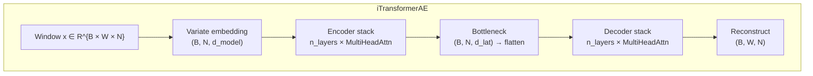

# iTransformer Autoencoder for Macroeconomic Regime Identification

Trabalho de Conclusão de Curso. Unsupervised identification of U.S. macroeconomic regimes from the
FRED-MD monthly panel using an inverted Transformer autoencoder, classical baselines, and a locked
statistical-validation panel.

The project is organised around three goals: (1) compress windows of the 128-series FRED-MD panel
into a low-dimensional latent space with a behaviour-preserving autoencoder; (2) cluster the latent
space into discrete regimes with K-Means or density methods; and (3) check whether the discovered
regimes carry economic signal that matches NBER recessions, structural breaks, and conditional
moments — and whether a non-trivial encoder is required at all.

---

## 1. Architecture

```mermaid
flowchart LR
    A[FRED-MD panel<br/>~128 series] --> B[Stationarity<br/>+ standardisation]
    B --> C[Sliding windows<br/>W ∈ {6, 12, 24}]
    C --> D[iTransformerAE<br/>variate-as-token]
    D --> E[Latent Z<br/>d ∈ {6, 7, 8, 9}]
    E --> F[K-Means<br/>K ∈ {3, 4, 5}]
    E -.-> F2[HDBSCAN<br/>density baseline]
    F --> G[Regime labels]
    F2 --> G
    G --> H[Locked panel<br/>7-metric validation]
    H --> I[MLflow<br/>tracking]
```



Each variate (economic series) is a token; attention is across variates inside one window. The model
optimises a masked MSE that respects the imputation-surface mask described below.

---

## 2. Models and Baselines

Every encoder below produces a per-window embedding `Z ∈ R^{T × d_lat}` that is fed to the same
downstream cluster+validation pipeline. This is what makes the comparison apples-to-apples.

### Primary

- **iTransformerAE** (`src/tcc_itransformer/model/`) — inverted Transformer autoencoder. Variate
  embeddings, multi-head attention across series, symmetric decoder. Hyperparameters: `window_size`,
  `d_model`, `n_heads`, `n_layers`, `latent_dim`, `dropout`, `learning_rate`. Loss: masked MSE under
  the D7 imputation policy.

### Falsification baselines (`tcc eval falsify`)

Built to answer "do we actually need a Transformer?" If any of these reach the iTransformer panel
within ±0.05 the encoder is not justified.

- **Linear AE** — single dense bottleneck `W × N → d_lat → W × N`, no non-linearity. Trained with
  the same masked MSE schedule.
- **MLP AE** — two-hidden-layer ReLU encoder/decoder around the same `d_lat`.
- **TruncatedSVD** — closed-form linear projection on flattened windows.

### Comparator baselines (`tcc eval baselines`)

Run per stage-2 config and produce one CSV with the locked 7-metric panel for each:

- **PCA-only** on raw stationary panel (no windowing).
- **Windowed PCA** — flatten window then PCA to `d_lat`.
- **Random embedding** — orthonormal random projection. Permutation-test reference.
- **Naive identity** — passthrough/last-value baseline used by the test-MSE comparison.

### State-space baselines (`tcc eval hdphmm`, optional `baselines` extra)

Weak-limit approximation via `dynamax.GaussianHMM` with a strong diagonal transition prior.

- **Sticky HDP-HMM** — priors `α=1.0, κ=50.0, γ=1.0`.
- **SDHDP-HMM**     — priors `α=0.3, κ=50.0, γ=0.5`.

### Density-clustering ablation (`tcc eval ablation`, `tcc eval hdbscan-sweep`)

Cross-cells of `{PCA, UMAP, t-SNE} × {KMeans, HDBSCAN}` over the cached embeddings, plus a focused
A3 grid sweep over `min_cluster_size ∈ {5, 10, 15, 20}`, `min_samples ∈ {1, 3, 5}`,
`n_neighbors ∈ {5, 15, 30}` (UMAP), and `perplexity ∈ {5, 15, 30, 50}` (t-SNE). Top-5 cells per DR
method are reported by DBCV.

---

## 3. Sweep Grid and Two-Stage HPO

### Stage 1 — LR × dropout (12 cells)

Pinned at the primary point `W = 12, d_lat = 8, K = 4`.

| dim | values |
|-----|--------|
| `learning_rate` | `1e-4`, `3e-4`, `1e-3` |
| `dropout`       | `0.0`, `0.1`, `0.2`, `0.3` |

Configs in [configs/sweep_stage1/](configs/sweep_stage1/). The winner is frozen into
[configs/stage1_winner.yaml](configs/stage1_winner.yaml) by `tcc winners stage1`.

### Stage 2 — W × d × K (36 cells)

| dim | values |
|-----|--------|
| `window_size` | `6`, `12`, `24` |
| `latent_dim`  | `6`, `7`, `8`, `9` |
| `n_clusters`  | `3`, `4`, `5` |

Configs in [configs/sweep/](configs/sweep/). Stage-2 reuses the frozen LR/dropout from stage 1.

### Pre-registered tiebreak

When several stage-2 configs sit within `tol` of the lowest `best_val_loss` (default `tol = 0.0`,
i.e. exact ties), `tcc winners stage2` picks the winner in this order:

1. smallest `n_clusters` K (parsimony of regime alphabet)
2. fewest approximate parameters `≈ W · d² · 4`
3. earliest `best_epoch` (training stability)

The winner is written to [configs/stage2_winner.yaml](configs/stage2_winner.yaml).

### Sweep optimisation

`tcc train sweep` groups stage-2 configs by `(W, d_lat)` and trains the autoencoder **once per
pair**, then evaluates each `K` post-hoc on the shared embeddings. Twelve trainings instead of 36.

---

## 4. Statistical Validation Panel

The locked 7-metric panel is computed by `compute_panel_metrics` in
[src/tcc_itransformer/evaluation/panel_metrics.py](src/tcc_itransformer/evaluation/panel_metrics.py).
Every model — including baselines — produces the same columns.

| metric | definition | rationale |
|---|---|---|
| `silhouette` | mean silhouette on test embeddings | within-vs-between cluster separation |
| `dbcv`       | density-based clustering validation | for HDBSCAN, where silhouette breaks |
| `nber_f1_frozen` | best F1 against NBER USREC, label↔regime map fit on **VAL only**, frozen on TEST | unbiased recession alignment (Q5 Tier 1) |
| `nber_f1_legacy` | best F1 against NBER USREC with map fit on TEST | reported alongside, tagged as biased |
| `bai_perron_f1`  | F1 against Bai–Perron breakpoints on the MFCI panel | data-driven structural breaks |
| `crisis_coverage` | fraction of NBER months covered by a non-modal regime | recall on rare regimes |
| `kw_signal`       | Kruskal–Wallis H over `Y_test` conditioned on regime | conditional-moment shift |
| `mw_pairwise`     | min Mann–Whitney p across regime pairs | weakest pair separation |
| `perm_p`          | permutation-test p-value vs random encoder | encoder informativeness |
| `bca_ci`          | BCa bootstrap 95 % CI around silhouette | uncertainty quantification |
| `n_eff`           | effective sample size after window overlap correction | honest power |
| `effective_rank`  | participation ratio of singular values of Z | latent-space usage |
| `isotropy`        | ratio of smallest to largest singular value | embedding pathology check |

Confound checks (`tcc eval confound`): chi-square against NBER, pre-2008 indicator, and
`|d INDPRO|` quartile; ARI with and without 2020-Q2 (Apr/May/Jun). Verdict is
**TRIGGERED** if `pre-2008 chi-square p < 0.01` and `Cramér's V > 0.4`.

---

## 5. Data, Splits, and Imputation

- **Source**: FRED-MD monthly snapshot, 128 series. Pulled by `tcc data download` with SHA-256
  verification. NBER USREC pulled separately by `tcc data pull-nber`.
- **Stationarity**: each series receives the FRED-MD-prescribed transform (codes 1..7) before
  standardisation; see [src/tcc_itransformer/data/stationarity.py](src/tcc_itransformer/data/stationarity.py).
- **Splits (Option B)**: chronological split with COVID kept on the **test** side. Rationale:
  the regime signal during COVID is precisely what we want to evaluate generalisation against,
  not what we want the model to fit.
- **D7 policy** (pre-analysis-plan addendum, 2026-04-29):
  - **Train / Val** keep all windows that touch imputed cells; the imputation surface mask is
    passed to the loss so reconstruction error is only counted on observed cells.
  - **Test** drops any window whose target cells were imputed. This guarantees test-MSE is
    measured against ground truth only.

---

## 6. Repository Layout

```
tcc_ai/
├── configs/
│   ├── default.yaml                   # primary single-run config
│   ├── stage1_winner.yaml             # output of `tcc winners stage1`
│   ├── stage2_winner.yaml             # output of `tcc winners stage2`
│   ├── sagemaker_ae_only*.yaml        # SageMaker-friendly AE-only variants
│   ├── sweep_stage1/                  # 12 LR × dropout configs
│   ├── sweep/                         # 36 W × d × K configs
│   ├── sweep_backfill/                # backfill list for re-runs
│   └── baselines_op/                  # per-baseline overrides
├── data/snapshots/                    # FRED-MD + NBER snapshots (gitignored)
├── docs/                              # pre-analysis plan, API ref, plans
├── notebooks/                         # EDA, embedding analysis
├── results/                           # MLflow store + figures (gitignored)
├── scripts/                           # thin shell wrappers around `tcc ...`
│   ├── data/{download,pull_nber,env_log}.sh
│   ├── configs/{gen_stage1,gen_stage2}.sh
│   ├── train/{single,sweep}.sh
│   ├── eval/{baselines,ablation,hdbscan_sweep,hdphmm,falsify,confound}.sh
│   ├── winners/{stage1,stage2}.sh
│   ├── analysis/export.sh
│   └── shell/run_stage1_bg.sh         # detached SM stage-1 launcher
├── sm_jobs/                           # SageMaker Estimator + entrypoint
├── src/tcc_itransformer/
│   ├── cli/main.py                    # typer CLI (entry point: `tcc`)
│   ├── config.py                      # ExperimentConfig (Pydantic v2)
│   ├── seed.py
│   ├── data/                          # FRED-MD loader, windowing, S3
│   ├── model/                         # iTransformerAE encoder/decoder/losses
│   ├── training/                      # trainer + callbacks
│   ├── evaluation/                    # clustering, panel metrics, baselines
│   ├── tracking/                      # MLflow integration
│   ├── pipelines/                     # one module per top-level workflow
│   └── utils/viz.py
└── tests/
    ├── unit/                          # fast, no GPU, no network
    ├── integration/                   # cross-module
    └── quality/                       # statistical quality gates
```

---

## 7. Command-Line Interface

The single entry point is `tcc`, declared in
[pyproject.toml](pyproject.toml) as `project.scripts`. All commands accept `--help`.

```text
tcc data download              fetch FRED-MD vintage CSV + SHA256
tcc data pull-nber             fetch NBER USREC monthly file
tcc data env-log               snapshot interpreter / GPU / package versions

tcc configs gen-stage1         emit 12 LR × dropout YAMLs
tcc configs gen-stage2         emit 36 W × d × K YAMLs (--frozen-stage1 PATH)

tcc train single --config PATH train + evaluate + log to MLflow
tcc train sweep [--dry-run]    train one AE per (W,d), eval every K post-hoc

tcc eval baselines             4-baseline locked panel CSV per config
tcc eval ablation              {PCA,UMAP,t-SNE} × {KMeans,HDBSCAN} grid
tcc eval hdbscan-sweep         A3 HDBSCAN parameter sweep, top-5 by DBCV
tcc eval hdphmm                Sticky / SDHDP-HMM (requires `baselines` extra)
tcc eval falsify               linear AE / MLP AE / SVD encoders
tcc eval confound              NBER / pre-2008 / |dINDPRO| chi-square + ARI

tcc winners stage1             pick stage-1 winner from SM job outputs
tcc winners stage2             pick stage-2 winner with pre-registered tiebreak

tcc analysis export            MLflow runs → LaTeX tables
```

Every subcommand lazy-imports its pipeline module so `tcc --help` does not load Torch.

---

## 8. Makefile Reference

The Makefile delegates to the `tcc` CLI for local runs and to `sm_jobs/launch_training.py` for AWS.
Key targets:

| target | purpose |
|---|---|
| `make install` | `uv sync` |
| `make download-data` / `make pull-nber` | data snapshots |
| `make generate-sweep-stage1` / `make generate-sweep-stage2` | emit sweep YAMLs |
| `make train` | single training (`configs/default.yaml`) |
| `make sweep` | full local sweep |
| `make baselines` | per-config baselines |
| `make hdphmm-baseline` | HMM baselines (override `CONFIG=`, `VARIANT=`, `N_STATES_MAX=`, `N_ITER=`) |
| `make export` | LaTeX export from MLflow |
| `make env-log` | snapshot interpreter / GPU / packages |
| `make test` / `make test-all` / `make test-quality` | pytest tiers |
| `make lint` / `make format` | ruff |
| `make ui` | MLflow UI on `:5000` |
| `make sm-build` / `make sm-push` | Docker image build + ECR push |
| `make sm-train` | one SageMaker training job |
| `make sm-train-local` | local smoke of the SM entrypoint |
| `make sm-sweep` | sequential SM sweep |
| `make sm-sweep-parallel` | bounded-parallel SM sweep + auto-poll |
| `make sm-poll` | poll outstanding SM jobs |
| `make reproduce` | `clean → download → generate → test → sweep` |

---

## 9. SageMaker Workflow

The estimator in [sm_jobs/launch_training.py](sm_jobs/launch_training.py) ships only `sm_jobs/`,
`src/`, and `configs/` to S3 (no `scripts/`, no `.venv/`, no `.git/`). The entrypoint
[sm_jobs/train_entrypoint.py](sm_jobs/train_entrypoint.py) imports
`tcc_itransformer.pipelines.single.run_full_pipeline` and writes embeddings + history under
`/opt/ml/output/data` for download.

Vocareum allowlist (verified 2026-04-30): only `m5.large`, `m5.xlarge`, `t3.*`, `c5.large`,
`c5.xlarge` are permitted; `m4`, `m6i`, `m7i`, and `m5.2xlarge+` are explicitly denied. Default is
`ml.m5.xlarge` (4 vCPU, 16 GB).

Stage-1 detached launcher: `bash scripts/shell/run_stage1_bg.sh`.

---

## 10. Reproducibility

- Every config sets `seed`. The runtime calls `set_global_seeds(seed)` covering Python `random`,
  NumPy, PyTorch (CPU + CUDA), and `PYTHONHASHSEED`.
- Data snapshots are content-addressed by SHA-256.
- `tcc data env-log` writes `docs/environment.json` with the interpreter, package versions, GPU
  details, and current git commit. Re-run before each major reporting milestone.
- All hyperparameters and metrics are logged to MLflow alongside the resolved config YAML.
- The pre-registered tiebreak (Section 3) eliminates ad-hoc winner selection.
- The pre-analysis plan ([docs/pre_analysis_plan.md](docs/pre_analysis_plan.md)) declares
  hypotheses, splits, and quality gates before runs.

---

## 11. Configuration

`ExperimentConfig` is a Pydantic v2 model in
[src/tcc_itransformer/config.py](src/tcc_itransformer/config.py). It validates types on load and
exposes `from_yaml(path)`, `to_yaml(path)`, and `model_copy(update=...)`.

Minimal example:

```yaml
seed: 42
window_size: 12
d_model: 64
n_heads: 4
n_layers: 2
latent_dim: 8
dropout: 0.1
n_clusters: 4
batch_size: 32
learning_rate: 0.001
max_epochs: 200
patience: 10
data_contract: fred_md_csv_v1
nber_usrec_path: data/snapshots/nber_usrec.csv
```

See [configs/default.yaml](configs/default.yaml) for the full set of options.

---

## 12. Testing

```bash
make test          # unit only
make test-all      # unit + integration
make test-quality  # statistical quality gates (requires a trained model)
```

Tests live under [tests/](tests/) split into `unit/`, `integration/`, and `quality/`. Quality gates
are guarded by the `quality` pytest mark.

---

## 13. Latest Metrics

To be re-run on Monday on this refactored codebase. Numbers and figures from prior runs are
deliberately omitted to avoid mixing pre- and post-refactor results.

---

## 14. Citation

```bibtex
@misc{tcc_itransformer_2026,
  title  = {Macroeconomic Regime Identification via Inverted Transformer Autoencoders},
  author = {TCC Authors},
  year   = {2026},
  note   = {Trabalho de Conclusão de Curso}
}
```

---

## 15. License

See [LICENSE](LICENSE).
