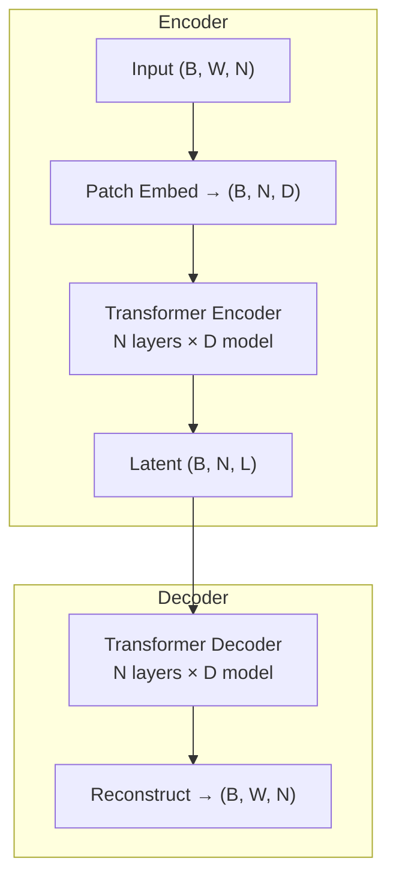

# iTransformer Autoencoder for Economic Regime Identification

> **TCC (Trabalho de Conclusão de Curso)** — Identifying macroeconomic regimes from FRED-MD data using an inverted Transformer autoencoder, adaptive PCA, and K-Means clustering with rigorous statistical validation.

## Architecture Overview

```mermaid
flowchart LR
    A[FRED-MD\n128 series] --> B[Windowing\nW∈{6,12,24}]
    B --> C[iTransformerAE\nvariate-as-token]
    C --> D[Latent\nEmbeddings]
    D --> E[Adaptive PCA\n≥90% var]
    E --> F[K-Means\nK∈{3,4,5}]
    F --> G[Regime Labels]
    G --> H[Statistical\nValidation]
    H --> I[MLflow\nTracking]
```

The **iTransformerAE** inverts the standard Transformer: each variate (economic series) is a token, and the attention mechanism captures cross-variate dependencies within each time window.



**Tensor shapes:** `B` = batch, `W` = window size, `N` = number of series (~128), `D` = d_model (32 or 64), `L` = latent_dim (4–12).

## Installation

```bash
# Clone and install
git clone <repo-url> && cd tcc_ai
uv sync

# Download FRED-MD data snapshot
make download-data
```

Requires Python 3.12+ and [uv](https://docs.astral.sh/uv/).

## Reproduction

```bash
# Full pipeline: download → generate configs → run sweep → export
make reproduce

# Or step by step:
make download-data       # Download FRED-MD snapshot with SHA-256 verification
make generate-sweep      # Generate 36 sweep configurations
make sweep               # Train all configurations (logs to MLflow)
make baselines           # Run baseline comparisons
make export              # Export results to LaTeX tables + figures
```

## Project Structure

```
tcc_ai/
├── configs/             # YAML experiment configs
│   ├── default.yaml
│   └── sweep/           # Generated sweep configs (36 combinations)
├── data/snapshots/      # FRED-MD data snapshot (gitignored)
├── docs/                # Pre-analysis plan, API reference, remediation plans
├── notebooks/           # EDA and analysis notebooks
├── results/             # MLflow tracking, figures, tables (gitignored)
├── scripts/             # Entry points (run_single, run_sweep, run_baselines)
├── src/tcc_itransformer/
│   ├── config.py        # Pydantic v2 experiment configuration
│   ├── seed.py          # Global seed management
│   ├── data/            # FRED-MD loading, preprocessing, windowing
│   ├── model/           # iTransformerAE (encoder, decoder, layers, losses)
│   ├── evaluation/      # Clustering, PCA, baselines, statistical tests
│   ├── tracking/        # MLflow integration
│   ├── training/        # Trainer, callbacks, early stopping
│   └── utils/           # Visualization utilities
└── tests/               # Unit, integration, and quality gate tests
```

## Configuration

All hyperparameters are defined in a single Pydantic model (`ExperimentConfig`). Create a YAML file:

```yaml
seed: 42
window_size: 12
d_model: 64
n_heads: 4
n_layers: 2
latent_dim: 8
n_clusters: 4
batch_size: 32
learning_rate: 0.001
max_epochs: 200
patience: 10
```

See [configs/default.yaml](configs/default.yaml) for the full default configuration.

## Statistical Validation

The pipeline applies a hierarchical testing framework:

| Level | Test | Purpose |
|-------|------|---------|
| Primary | Kruskal-Wallis + BH-FDR | Per-dimension cluster separation |
| Primary | Pairwise Mann-Whitney + BH-FDR | Pairwise cluster differences |
| Primary | BCa Bootstrap CI | Confidence intervals for effect sizes |
| Exploratory | W=24 analysis | Tagged as exploratory (limited power) |
| Baseline | Permutation test | Model vs. 4 naive baselines |

**Note:** Window size W=24 analyses are tagged `analysis_type=exploratory` with power warnings due to reduced effective sample size.

## Results

*Results placeholder — populated after running experiments.*

## Pre-Analysis Plan

See [docs/pre_analysis_plan.md](docs/pre_analysis_plan.md) for the registered analysis plan including hypotheses, quality gates, and data exclusion criteria.

## Citation

```bibtex
@misc{tcc_itransformer_2025,
  title   = {Economic Regime Identification via Inverted Transformer Autoencoders},
  author  = {TCC Authors},
  year    = {2025},
  note    = {Trabalho de Conclusão de Curso}
}
```

## License

See [LICENSE](LICENSE).