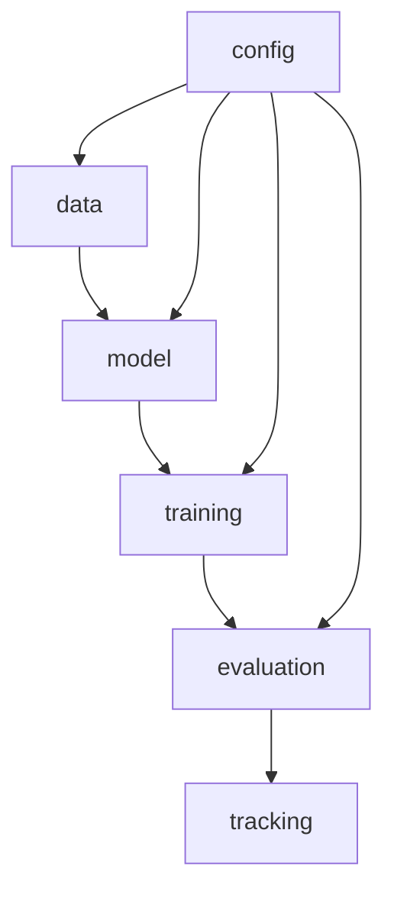
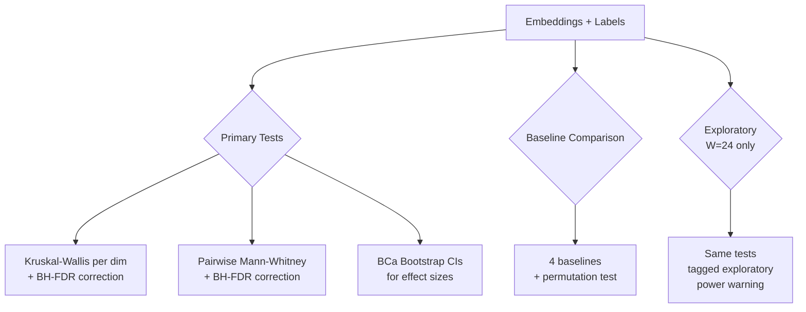

# API Reference

## Tensor Shape Flow

The iTransformerAE uses a **variate-as-token** architecture where each economic series is treated as a token.

| Stage | Shape | Description |
|-------|-------|-------------|
| Raw input | `(B, W, N)` | Batch × Window × Series |
| Patch embedding | `(B, N, D)` | Each series projected to d_model |
| Encoder output | `(B, N, D)` | After N_layers transformer blocks |
| Latent bottleneck | `(B, N, L)` | Compressed to latent_dim |
| Decoder output | `(B, N, D)` | Reconstructed representation |
| Final output | `(B, W, N)` | Reconstructed time series window |

Where: `B` = batch size, `W` ∈ {6, 12, 24}, `N` ≈ 128 series, `D` ∈ {32, 64}, `L` ∈ {4–12}.

## Module Dependency

## Modules

### `tcc_itransformer.config`

- **`ExperimentConfig`** — Pydantic v2 model with all hyperparameters. YAML serialization via `from_yaml()` / `to_yaml()`. Validates `n_heads | d_model` and `latent_dim ≤ d_model`.

### `tcc_itransformer.data`

- **`load_fred_md(path)`** — Load FRED-MD CSV with SHA-256 verification.
- **`FredMDPreprocessor`** — Handles missing data, stationarity transforms, standardization.
- **`WindowDataset`** — PyTorch Dataset producing `(window, index)` tensors.

### `tcc_itransformer.model`

- **`iTransformerAE`** — Full autoencoder: encoder → latent → decoder.
- **`iTransformerEncoder`** — Variate-as-token transformer encoder.
- **`iTransformerDecoder`** — Symmetric decoder with reconstruction head.
- **`ReconstructionLoss`** — MSE-based reconstruction loss.

### `tcc_itransformer.training`

- **`Trainer`** — Training loop with early stopping, LR scheduling, gradient clipping.
- **`EarlyStopping`** — Patience-based callback monitoring validation loss.

### `tcc_itransformer.evaluation`

- **`fit_adaptive_pca(embeddings, threshold=0.9)`** — PCA retaining ≥ threshold variance.
- **`fit_kmeans(pca_data, k)` / `select_k(data, k_range)`** — K-Means with silhouette-based selection.
- **`compute_clustering_metrics(data, labels)`** — Silhouette, Calinski-Harabasz, Davies-Bouldin.
- **`clustering_stability(data, k, n_runs)`** — Mean ARI across random re-initializations.
- **`compute_regime_transitions(labels)`** — Count regime change points.
- **`kruskal_wallis_per_dim(embeddings, labels)`** — KW test per PCA dim with BH-FDR + BCa CIs.
- **`pairwise_mann_whitney(embeddings, labels)`** — MW U per pair×dim with BH-FDR + BCa CIs.
- **`permutation_test(x, y, stat_fn, n_perm)`** — Two-sample permutation test.
- **`moving_block_bootstrap(statistic_fn, data, block_length, ...)`** — Block bootstrap for dependent data.
- **`compute_effective_n(data)`** — Effective sample size accounting for autocorrelation.
- **`run_all_baselines(embeddings, k)`** — PCA-only, random projection, raw features, random labels.

### `tcc_itransformer.tracking`

- **`log_config(config, run_name)`** — Log config to MLflow with git commit tag.
- **`log_metrics(metrics, step)`** — Log metric dict to active MLflow run.

### `tcc_itransformer.utils`

- **`viz.py`** — Plotting functions for embeddings, clusters, training curves.

## Statistical Testing Hierarchy

