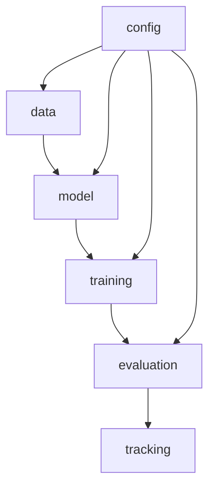
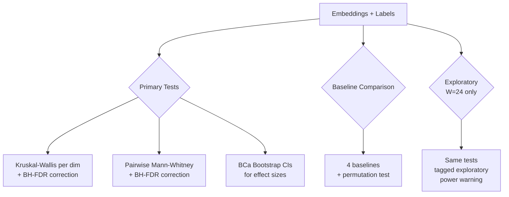

# API Reference

## Tensor Shape Flow

The iTransformerAE uses a **variate-as-token** architecture where each economic series is treated as a token.

| Stage | Shape | Description |
|-------|-------|-------------|
| Raw input | `(B, W, N)` | Batch × Window × Series |
| Patch embedding | `(B, N, D)` | Each series projected to d_model |
| Encoder output | `(B, N, D)` | After N_layers transformer blocks |
| Latent bottleneck | `(B, N, L)` | Compressed to latent_dim |
| Decoder output | `(B, N, D)` | Reconstructed representation |
| Final output | `(B, W, N)` | Reconstructed time series window |

Where: `B` = batch size, `W` ∈ {6, 12, 24}, `N` ≈ 128 series, `D` ∈ {32, 64}, `L` ∈ {4–12}.

## Module Dependency

## Modules

### `tcc_itransformer.config`

- **`ExperimentConfig`** — Pydantic v2 model with all hyperparameters. YAML serialization via `from_yaml()` / `to_yaml()`. Validates `n_heads | d_model` and `latent_dim ≤ d_model`.

### `tcc_itransformer.data`

- **`load_fred_md(path)`** — Load FRED-MD CSV with SHA-256 verification.
- **`FredMDPreprocessor`** — Handles missing data, stationarity transforms, standardization.
- **`WindowDataset`** — PyTorch Dataset producing `(window, index)` tensors.

### `tcc_itransformer.model`

- **`iTransformerAE`** — Full autoencoder: encoder → latent → decoder.
- **`iTransformerEncoder`** — Variate-as-token transformer encoder.
- **`iTransformerDecoder`** — Symmetric decoder with reconstruction head.
- **`ReconstructionLoss`** — MSE-based reconstruction loss.

### `tcc_itransformer.training`

- **`Trainer`** — Training loop with early stopping, LR scheduling, gradient clipping.
- **`EarlyStopping`** — Patience-based callback monitoring validation loss.

### `tcc_itransformer.evaluation`

- **`fit_adaptive_pca(embeddings, threshold=0.9)`** — PCA retaining ≥ threshold variance.
- **`fit_kmeans(pca_data, k)` / `select_k(data, k_range)`** — K-Means with silhouette-based selection.
- **`select_k_combined(data, k_range)`** — averages normalized Silhouette and `−BIC/GMM` (pre_projeto §4.3).
- **`compute_clustering_metrics(data, labels)`** — Silhouette, Calinski-Harabasz, Davies-Bouldin.
- **`clustering_stability(data, k, n_runs)`** — Mean ARI across random re-initializations.
- **`compute_regime_transitions(labels)`** — Count regime change points.
- **`kruskal_wallis_per_dim(embeddings, labels)`** — KW test per PCA dim with BH-FDR + BCa CIs.
- **`pairwise_mann_whitney(embeddings, labels)`** — MW U per pair×dim with BH-FDR + BCa CIs.
- **`permutation_test(x, y, stat_fn, n_perm)`** — Two-sample permutation test.
- **`moving_block_bootstrap(statistic_fn, data, block_length, ...)`** — Block bootstrap for dependent data.
- **`compute_effective_n(data)`** — Effective sample size accounting for autocorrelation.
- **`run_all_baselines(embeddings, k)`** — PCA-only, random projection, raw features, random labels.

#### Principal pipeline (UMAP + HDBSCAN, pre_projeto §4.3)

- **`fit_umap(emb, UMAPConfig)` / `apply_umap(emb, reducer)`** — UMAP dimensionality reduction with `random_state` for reproducibility.
- **`fit_hdbscan(X, min_cluster_size, min_samples)`** — HDBSCAN with `relative_validity_` (DBCV proxy).
- **`optimize_hdbscan_dbcv(X, min_cluster_sizes, min_samples_grid, max_noise_fraction)`** — grid search returning `(HDBSCANResult, log)`.
- **`HDBSCANResult`** — `labels`, `probabilities` (soft membership), `dbcv`, `n_clusters`, `noise_fraction`, `clusterer`.

#### Regime validation (pre_projeto §4.4)

- **`nber_overlap(labels, dates, usrec, lead, lag)`** → `NBEROverlapResult(precision, recall, f1, matched_cluster)` (excludes noise=−1).
- **`bai_perron_alignment(labels, series, n_breaks=None, penalty=10.0)`** — uses `ruptures.Pelt`/`Dynp` to align cluster-change points to structural breaks.
- **`crisis_window_coverage(labels, dates, windows=CANONICAL_CRISIS_WINDOWS)`** — dominant cluster per dotcom/GFC/COVID window.
- **`regime_conditional_moments(panel, labels)`** — MultiIndex `(regime, statistic)` DataFrame.
- **`transition_matrix(labels)`** — row-normalized `P[i→j]` (excludes noise).
- **`regime_durations(labels)`** — `n_runs`, mean/median/max duration, total months.
- **`explain_assignment(panel, labels, probabilities, ...)`** → list of per-window dicts `{regime, soft_membership, top_features}`; `explanations_to_frame(...)` returns long-format DataFrame.

### `tcc_itransformer.data` (extras)

- **`check_series_stationarity(x, name, alpha=0.05)`** — joint ADF + KPSS rule (`pre_projeto §4.2`).
- **`validate_panel_stationarity(df, alpha)`** — applies the joint test column-wise.
- **`load_usrec(path)`** — loads NBER USREC monthly indicator (binary 0/1).
- **`load_panel_from_s3(bucket, prefix, date_column)`** — auto-resolves `SM_CHANNEL_TRAINING` (SageMaker) vs `s3://` (local + s3fs).
- **`resolve_output_dir()` / `resolve_aux_output_dir()`** — `SM_MODEL_DIR` / `SM_OUTPUT_DATA_DIR` with local fallbacks.

### `tcc_itransformer.tracking`

- **`log_config(config, run_name)`** — Log config to MLflow with git commit tag.
- **`log_metrics(metrics, step)`** — Log metric dict to active MLflow run.

### `tcc_itransformer.utils`

- **`viz.py`** — Plotting functions for embeddings, clusters, training curves.

## Statistical Testing Hierarchy

## SageMaker integration

- **`sagemaker/train_entrypoint.py`** — SageMaker-compliant entrypoint. Reads channels:
  - `SM_CHANNEL_TRAINING` → first `*.csv` (FRED-MD format) or `*.parquet` directory.
  - `SM_CHANNEL_USREC` → first `*.csv` (NBER USREC).
  Outputs:
  - `SM_MODEL_DIR/{metrics.json, config.yaml}` (packaged into `model.tar.gz`).
  - `SM_OUTPUT_DATA_DIR/{history.json, moments.parquet, durations.parquet, transition_matrix.parquet, explanations.parquet, hdbscan_grid.json, test_labels.parquet}` (packaged into `output.tar.gz`).
  Logs all metrics + artifacts to MLflow if `MLFLOW_TRACKING_URI` is set.

- **`sagemaker/launch_training.py`** — wraps `sagemaker.pytorch.PyTorch` Estimator. Hyperparameters are passed as CLI args to the entrypoint; image URI defaults to PyTorch 2.4 GPU DLC, override with `--image-uri`.

- **`scripts.run_single.run_full_pipeline(config, model_dir, aux_dir)`** — pure-Python wrapper invoked by the entrypoint; also usable locally for reproducible runs without MLflow.

### Make targets

| Target | Purpose |
|---|---|
| `make pull-nber` | Download NBER USREC snapshot |
| `make sm-build` / `sm-push` | Build + push training image to ECR |
| `make sm-train` | Launch one SageMaker training job |
| `make sm-sweep` | Iterate `configs/sweep/*.yaml` |
