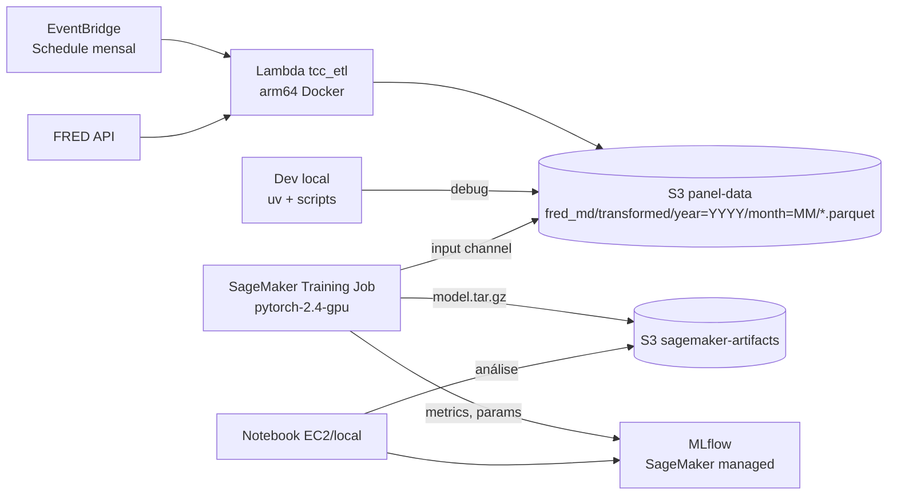

# Guia de Deploy AWS — TCC iTransformer

> Pipeline ponta-a-ponta: **Lambda ETL → S3 (Parquet) → SageMaker Training Job → MLflow → S3 (artefatos)**.
>
> Pré-requisito: AWS CLI configurado (`aws sts get-caller-identity` retorna sua identidade), Terraform 1.14+, Docker, Python 3.12, [uv](https://docs.astral.sh/uv/).

---

## 0. Visão geral



**Buckets:**
| Bucket | Conteúdo | Lifecycle |
|---|---|---|
| `tcc-regime-etl-panel-data` | Parquet ETL (raw + transformed + metadata) | versioning + 30 dias |
| `tcc-regime-etl-sagemaker` (NOVO) | model.tar.gz, MLflow artifacts | 90 dias |

---

## 1. Provisionar infra (Terraform)

### 1.1 Bootstrap state (uma vez)
```bash
cd tcc_iac
bash scripts/bootstrap-tfstate.sh   # cria bucket S3 + DynamoDB lock
```

### 1.2 ETL stack (já existe)
```bash
cd tcc_iac/infra
terraform init
terraform plan -var="github_org=compsci-squad"
terraform apply
```
Outputs relevantes:
- `panel_bucket_name` → use em `tcc_ai`
- `lambda_function_name`
- `ecr_etl_repository_url`

### 1.3 SageMaker stack (a criar — Wave 4)
Adicionar arquivos em `tcc_iac/infra/`:

**`sagemaker.tf`**
```hcl
resource "aws_ecr_repository" "training" {
  name                 = "${var.project_name}-training"
  image_tag_mutability = "MUTABLE"
  image_scanning_configuration { scan_on_push = true }
  tags = local.common_tags
}

resource "aws_s3_bucket" "sagemaker" {
  bucket = "${var.project_name}-sagemaker"
  tags   = local.common_tags
}

data "aws_iam_policy_document" "sm_assume" {
  statement {
    actions = ["sts:AssumeRole"]
    principals {
      type        = "Service"
      identifiers = ["sagemaker.amazonaws.com"]
    }
  }
}

resource "aws_iam_role" "sagemaker_execution" {
  name               = "${var.project_name}-sagemaker-exec"
  assume_role_policy = data.aws_iam_policy_document.sm_assume.json
  tags               = local.common_tags
}

resource "aws_iam_role_policy_attachment" "sm_managed" {
  role       = aws_iam_role.sagemaker_execution.name
  policy_arn = "arn:aws:iam::aws:policy/AmazonSageMakerFullAccess"
}

data "aws_iam_policy_document" "sm_buckets" {
  statement {
    actions = ["s3:GetObject", "s3:PutObject", "s3:ListBucket", "s3:DeleteObject"]
    resources = [
      aws_s3_bucket.panel.arn, "${aws_s3_bucket.panel.arn}/*",
      aws_s3_bucket.sagemaker.arn, "${aws_s3_bucket.sagemaker.arn}/*",
    ]
  }
}

resource "aws_iam_policy" "sm_buckets" {
  name   = "${var.project_name}-sm-buckets"
  policy = data.aws_iam_policy_document.sm_buckets.json
}

resource "aws_iam_role_policy_attachment" "sm_buckets" {
  role       = aws_iam_role.sagemaker_execution.name
  policy_arn = aws_iam_policy.sm_buckets.arn
}
```

**`mlflow.tf`** (opção managed — região precisa suportar; us-east-1 sim)
```hcl
resource "aws_sagemaker_mlflow_tracking_server" "main" {
  tracking_server_name  = "${var.project_name}-mlflow"
  artifact_store_uri    = "s3://${aws_s3_bucket.sagemaker.bucket}/mlflow-artifacts/"
  role_arn              = aws_iam_role.sagemaker_execution.arn
  tracking_server_size  = "Small"   # ~$0.65/h
  automatic_model_registration = true
  tags = local.common_tags
}

output "mlflow_tracking_uri" { value = aws_sagemaker_mlflow_tracking_server.main.tracking_server_arn }
```

> **Custo:** MLflow Small ≈ US$ 15/dia. Para economizar, parar quando não estiver usando: `aws sagemaker stop-mlflow-tracking-server --tracking-server-name tcc-regime-etl-mlflow`. Alternativa zero-custo: `MLFLOW_TRACKING_URI=file:///opt/ml/output/mlflow` + sync para S3 no final do job.

**`outputs.tf`** — adicionar:
```hcl
output "training_ecr_url"        { value = aws_ecr_repository.training.repository_url }
output "sagemaker_role_arn"      { value = aws_iam_role.sagemaker_execution.arn }
output "sagemaker_bucket_name"   { value = aws_s3_bucket.sagemaker.bucket }
output "panel_bucket_name"       { value = aws_s3_bucket.panel.bucket }
```

```bash
terraform apply
terraform output -raw training_ecr_url   # guardar
```

---

## 2. Disparar a Lambda ETL pela primeira vez

```bash
aws lambda invoke \
  --function-name tcc-regime-etl \
  --payload '{}' \
  --cli-binary-format raw-in-base64-out \
  /tmp/etl-out.json
cat /tmp/etl-out.json   # esperado: {"statusCode": 200, "series": 126, "rows": ~800, ...}

# Verificar saída
aws s3 ls s3://tcc-regime-etl-panel-data/fred_md/transformed/ --recursive
```

A schedule mensal (`cron(0 22 20 * ? *)`) já está ativa — só roda dia 20 do mês.

---

## 3. Build & push da imagem de treino SageMaker

`tcc_ai/sagemaker/Dockerfile.training`:
```dockerfile
FROM 763104351884.dkr.ecr.us-east-1.amazonaws.com/pytorch-training:2.4.0-gpu-py311-cu121-ubuntu22.04-sagemaker

ENV PYTHONUNBUFFERED=1 PIP_NO_CACHE_DIR=1
WORKDIR /opt/ml/code

COPY pyproject.toml ./
COPY src/ ./src/
COPY sagemaker/requirements.txt ./
RUN pip install --no-deps -e . && pip install -r requirements.txt

ENV SAGEMAKER_PROGRAM=sagemaker/train_entrypoint.py
```

`tcc_ai/sagemaker/requirements.txt`:
```
hdbscan>=0.8.33
umap-learn>=0.5.5
ruptures>=1.1.9
mlflow>=2.18,<3
boto3>=1.34
pyarrow>=15
s3fs>=2024.3
```

Build & push (script novo `tcc_ai/Makefile`):
```makefile
ECR_TRAIN := $(shell terraform -chdir=../tcc_iac/infra output -raw training_ecr_url)
REGION    := us-east-1

sm-build:
	aws ecr get-login-password --region $(REGION) | \
	  docker login --username AWS --password-stdin 763104351884.dkr.ecr.$(REGION).amazonaws.com
	aws ecr get-login-password --region $(REGION) | \
	  docker login --username AWS --password-stdin $(ECR_TRAIN)
	docker buildx build --platform linux/amd64 \
	  -f sagemaker/Dockerfile.training -t $(ECR_TRAIN):latest --push .
```

```bash
cd tcc_ai
make sm-build       # ~10-15 min na primeira vez
```

---

## 4. Entrypoint SageMaker

`tcc_ai/sagemaker/train_entrypoint.py` (esqueleto):
```python
import argparse, json, os
from pathlib import Path

import mlflow

from tcc_itransformer.config import ExperimentConfig
from tcc_itransformer.pipeline import run_full_pipeline   # refatorar de run_single.py

def main():
    p = argparse.ArgumentParser()
    p.add_argument("--config", default="configs/default.yaml")
    # SageMaker injeta hiperparâmetros como --kebab-case
    p.add_argument("--window-size", type=int, default=12)
    p.add_argument("--latent-dim", type=int, default=8)
    p.add_argument("--n-clusters", type=int, default=4)
    args, _ = p.parse_known_args()

    train_dir = Path(os.environ["SM_CHANNEL_TRAINING"])
    model_dir = Path(os.environ["SM_MODEL_DIR"])
    output_dir = Path(os.environ["SM_OUTPUT_DATA_DIR"])

    cfg = ExperimentConfig.from_yaml(args.config).model_copy(update={
        "window_size": args.window_size,
        "latent_dim":  args.latent_dim,
        "n_clusters":  args.n_clusters,
        "data_path":   str(train_dir),     # diretório com parquets
        "results_dir": str(output_dir),
    })

    mlflow.set_tracking_uri(os.environ.get("MLFLOW_TRACKING_URI", "file:" + str(output_dir / "mlruns")))
    mlflow.set_experiment("itransformer-sagemaker")

    with mlflow.start_run(run_name=os.environ.get("TRAINING_JOB_NAME", "local")):
        results = run_full_pipeline(cfg, model_dir=model_dir)
        (output_dir / "metrics.json").write_text(json.dumps(results, indent=2))

if __name__ == "__main__":
    main()
```

> **Refator necessário (W3.1):** extrair de `scripts/run_single.py` uma função pura `run_full_pipeline(cfg, model_dir) -> dict`.

---

## 5. Lançar um job de treino

`tcc_ai/sagemaker/launch_training.py`:
```python
import os, sagemaker
from sagemaker.pytorch import PyTorch

sess = sagemaker.Session()
role = os.environ["SM_EXEC_ROLE_ARN"]
image = os.environ["TRAINING_IMAGE_URI"]
panel_bucket = os.environ["PANEL_BUCKET"]
sm_bucket    = os.environ["SM_BUCKET"]
mlflow_uri   = os.environ.get("MLFLOW_TRACKING_URI", "")

est = PyTorch(
    image_uri        = image,
    role             = role,
    instance_count   = 1,
    instance_type    = "ml.g4dn.xlarge",      # GPU T4 ~$0.74/h
    max_run          = 3600,
    output_path      = f"s3://{sm_bucket}/models/",
    sagemaker_session= sess,
    environment      = {"MLFLOW_TRACKING_URI": mlflow_uri},
    hyperparameters  = {"window-size": 12, "latent-dim": 8, "n-clusters": 4},
    base_job_name    = "itransformer",
)

est.fit({"training": f"s3://{panel_bucket}/fred_md/transformed/"}, wait=True)
print("model:", est.model_data)
```

```bash
export SM_EXEC_ROLE_ARN=$(terraform -chdir=../tcc_iac/infra output -raw sagemaker_role_arn)
export TRAINING_IMAGE_URI=$(terraform -chdir=../tcc_iac/infra output -raw training_ecr_url):latest
export PANEL_BUCKET=$(terraform -chdir=../tcc_iac/infra output -raw panel_bucket_name)
export SM_BUCKET=$(terraform -chdir=../tcc_iac/infra output -raw sagemaker_bucket_name)
export MLFLOW_TRACKING_URI=$(terraform -chdir=../tcc_iac/infra output -raw mlflow_tracking_uri)

uv run python sagemaker/launch_training.py
```

---

## 6. Sweep — 36 jobs em paralelo

`tcc_ai/sagemaker/launch_sweep.py` (esboço):
```python
import yaml
from pathlib import Path
from launch_training import build_estimator   # refator do passo 5

for cfg_path in sorted(Path("configs/sweep").glob("*.yaml")):
    cfg = yaml.safe_load(cfg_path.read_text())
    est = build_estimator(hyperparameters={
        "window-size": cfg["window_size"],
        "latent-dim":  cfg["latent_dim"],
        "n-clusters":  cfg["n_clusters"],
    }, base_job_name=f"itr-{cfg_path.stem}")
    est.fit({"training": f"s3://{PANEL}/fred_md/transformed/"}, wait=False)  # async
```

**Custo estimado:** 36 jobs × 30 min × `ml.g4dn.xlarge` (US$ 0,74/h) ≈ **US$ 13** por sweep completo.

---

## 7. Coletar resultados

```bash
# 1) MLflow UI (managed)
aws sagemaker create-presigned-mlflow-tracking-server-url \
  --tracking-server-name tcc-regime-etl-mlflow

# 2) Baixar modelos do sweep
aws s3 sync s3://tcc-regime-etl-sagemaker/models/ ./results/sagemaker/ \
  --exclude "*" --include "itr-*"

# 3) Exportar tabelas/figuras (Wave 8.2)
make export
```

---

## 8. Custos esperados (mensal)

| Recurso | Quantidade | US$ |
|---|---|---|
| Lambda ETL | 1 invoke/mês × 5 min × 1 GB | < $0.01 |
| S3 panel-data | < 1 GB | < $0.05 |
| ECR (2 repos) | < 5 GB | $0.50 |
| SageMaker Training (1 sweep/mês) | 36 × 0,5h × ml.g4dn.xlarge | $13 |
| SageMaker MLflow Small | 24h × 30 dias (se ligado) | $470 ⚠ |
| **Total se MLflow só ligado durante análise** (~10h/mês) | | **~$20** |

> **Recomendação forte:** automatizar `start/stop` do MLflow tracking server em torno dos jobs (lifecycle hook ou cron local). Ou ir de fallback: MLflow embedado no job + sync para S3.

---

## 9. Troubleshooting

| Sintoma | Causa provável | Fix |
|---|---|---|
| `AccessDenied` em `s3:GetObject` no job | role SM não tem policy do panel bucket | revisar `aws_iam_policy.sm_buckets` |
| `ModuleNotFoundError: hdbscan` no container | `requirements.txt` não copiado | revisar Dockerfile COPY |
| Job pendente em "InProgress" sem logs | imagem ainda em pull (ECR cold) | aguardar; rodar warm-up `aws ecr describe-images` |
| `MLFLOW_TRACKING_URI` rejeitado | falta permissão `sagemaker-mlflow:*` | usar policy `AmazonSageMakerFullAccess` |
| Custos altos repentinos | MLflow tracking server ligado 24/7 | stop quando não usar |

---

## 10. Checklist pré-defesa

- [ ] `terraform apply` reproduzível em conta limpa
- [ ] `make sm-build && make sm-train` roda sem intervenção
- [ ] `make sm-sweep` produz 36 runs no MLflow
- [ ] `make export` gera tabelas LaTeX a partir do MLflow remoto
- [ ] README do monorepo aponta para este guia
- [ ] Custo mensal documentado em [tcc.md](../../docs/tcc.md) §Recursos
